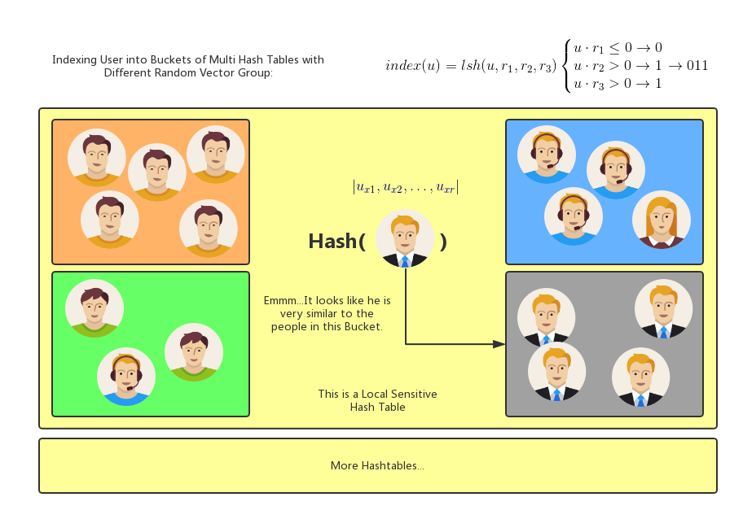
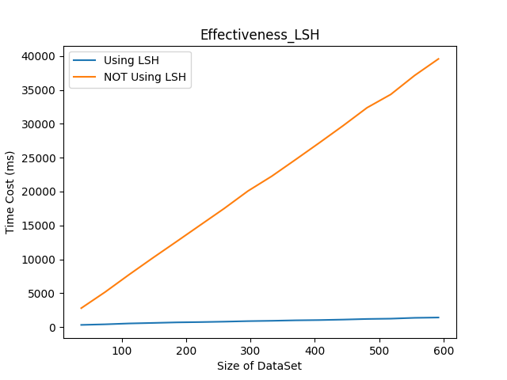
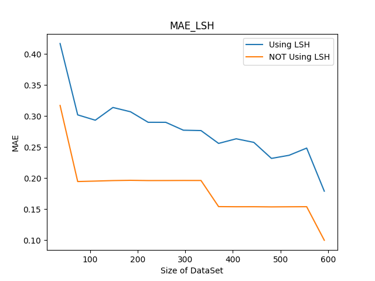
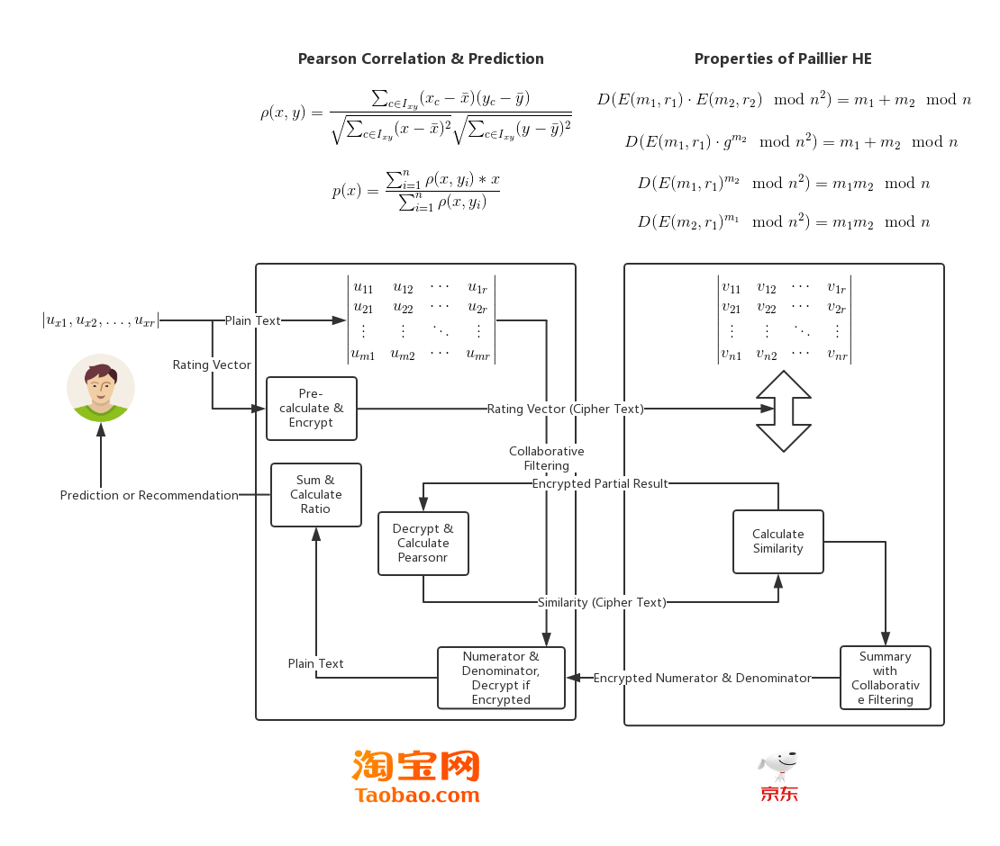

# 摘要
随着互联网和普及和电子商务的发展，推荐系统逐渐成为该领域的一个重要的研究内容，受到越来越多的研究者的关注。如今几乎所有大型电子商务网站都不同程度的提供了各种形式的推荐系统。
协同过滤(Collaborative Filtering, CF)算法是个性化推荐系统中诞生较早，较为成功且应用非常广泛的技术之一。影响协同过滤算法推荐质量的主要因素之一是目标用户的K最近邻用户准确度，算法随后基于这些用户对目标用户尚未评价的项目进行预测。
协同过滤算法依赖用户历史行为数据。随着电子商务系统规模的扩大，用户数目与项目数目急剧上升，并且用户评分数据稀疏性极高，传统协同过滤算法无法保证推荐的实时性。针对这种现象，提出基于局部敏感哈希(Local Sensitive Hashing, LSH)的协同过滤算法，将评分数据降维并存储在哈希表中，降低近邻用户计算成本。
更大的数据集有助于协同过滤算法得到更准确的推荐结果，并能在一定程度上解决基于协同过滤的推荐系统对于新个体存在的“冷启动”问题。但这些数据通常分别属于不同平台，出于数据价值和用户隐私的考虑，这些平台不愿意将数据提供给其他方。针对这种现象，提出基于同态加密(Homomorphic Encryption, HE)的协同过滤算法，保护各平台数据隐私的同时，为用户提供精准的推荐服务。

## 关键词
推荐算法，局部敏感哈希，隐私保护，同态加密

# Abstract
With the development of the Internet and e-commerce, the recommendation system has gradually become an important research content and has received more and more attention from researchers. Almost all major e-commerce websites now offer variety forms of recommendation systems.
Collaborative Filtering (CF) algorithm is one of the earlier, most successful and widely used technologies in personalized recommendation systems. One of the main factors affecting the recommendation quality of the collaborative filtering algorithm is the target user's K nearest neighbor user accuracy, and the algorithm then makes predictions based on these users' items that have not yet been evaluated by the target user.
Collaborative filtering algorithms rely on historical user behavior data. With the expansion of the scale of e-commerce systems, the number of users and the number of projects have risen sharply, and user scoring data has sparseness. Traditional collaborative filtering algorithms cannot guarantee the real-time performance of recommendations. Aiming at this phenomenon, a collaborative filtering algorithm based on Local Sensitive Hashing (LSH) is proposed. The scoring data is reduced dimensionally and stored in a hash table, which reduces the computation cost of neighboring users.
Larger data sets help collaborative filtering algorithms get more accurate recommendations. However, these data usually belong to different platforms. For the sake of data value and user privacy, these platforms are not willing to provide data to other parties. For this phenomenon, a collaborative filtering algorithm based on Homomorphic Encryption (HE) is proposed to protect the data privacy of each platform and provide users with accurate recommendation services.

## Keywords
Recommender Algorithm, Local Sensitive Hashing, Privacy Preserving, Homomorphic Encryption

# 内容提要

## 研究背景及意义
针对基于协同过滤的推荐系统中存在的“冷启动”问题以及为了进一步提升推荐的准确性，系统的使用者有扩充数据集容量的需求，而这种扩充伴随这两个明显的问题：其一，传统的经典协同过滤推荐系统在维度和稀疏程度高的用户-项目评分矩阵上运行效率较低，实时性差；其二，扩充数据集容量的最有效方式是借助其他平台的数据，但这些属于不同平台的数据通常出于用户及商业隐私的考虑，不能被直接共享。针对以上两点问题，本文对提高基于协同过滤的推荐系统的实时性以及保障数据隐私的情况下多方参与推荐结果计算两个问题进行探究。

## 国内外研究现状
1992年Xerox公司在解决研究中心咨询过载问题时，为帮助员工处理邮件过多的问题，最早公开应用了名为Tapestry的协同过滤算法模型。此后于1994年，名为GroupLens的系统改进了此模型并作为新闻筛选和推荐的系统，可以视为是目前广为使用的基于协同过滤的推荐系统的经典实现。此后，协同过滤在各大电商网站上流行起来，以亚马逊的图书业务为代表。如今，基于协同过滤的推荐系统在新闻，电影，音乐等领域都以不同形式，不同实现方式被广为应用。

数据的隐私保护问题最早由Dalenius于20世纪70年代末提出，他认为保护数据库中的隐私信息，就是要使任何对数据库的访问过程中无法获取关于任意个体的确切信息，这一定论具有一定理论指导意义，但缺乏量化标准。从目前的研究成果来看，k-anonymity[@Sweeney2012]及其扩展模型在数据隐私保护领域具有非常深远的影响，其基本思想是将数据集中与攻击者背景知识相关的属性进行泛化和压缩处理，使得数据集中的所有记录被划分至若干个等价类，因此这类模型也被称为基于分组的隐私保护模型。但后续研究和实践表明这类模型无法对数据隐私提供足够的安全保障。其改进版本l-diversity[@Machanavajjhala2006L]，(a, k)-anonymity[@Wong2006]，t-closeness[@Li2007t]，M-invariance[@Xiao2007M]，m-confidentiality[@Wong2007Minimality]相继被提出。尽管如此，“合成式”攻击 [@Ganta2008Composition] ，“前景知识”攻击[@Wong2011Can]，“deFinetti”攻击[@Kifer2009Attacks]等新的攻击方式都对基于分组的隐私保护模型形成了挑战。这些攻击能够成功的根本原因在于基于分组的隐私保护模型的安全性与攻击者所掌握的背景知识相关，而所有可能被攻击者掌握的背景知识很难被充分定义。此外，由于缺少一种明确的量化标准来评估这些模型的隐私保护水平，因此这些模型的可靠性难以保证。

1976年前，广为使用的加密方式为对称加密，即加密规则于解密规则为同一规则，因此存在密钥传输过程的安全性问题。1976年，Diffie和Hellman提出了非对称加密的构思[@Diffie1976Multiuser]，保证了只要私钥不透露，通信即可视为安全的。1997年，Rivest，Shamir和Adleman设计了一种名为“RSA”的加密算法，实现了非对称加密，对密码学甚至信息技术领域产生了深远的影响。

同态加密时密码学领域的一个重要课题，它支持在被委托方仅持有密文的情况下参与并完成代数计算。以往人们只找到一些部分实现这些操作的方法，如“RSA加密算法”满足乘法同态性质，由Paillier于1999年提出的“Paillier”加密算法则满足加法同态性质。而2009年9月由Gentry发表的论文[@Gentry2009A]从数学上提出了“全同态加密”的可行方法，即可以在不解密的情况下对密文数据进行所有可以在明文上进行的运算，这是同态加密技术上的决定性突破，同样对信息技术产业具有重大价值。

Dwork于2006年提出的差分隐私(Differential Privacy, DP)[@Dwork2006Differential]对数据的隐私保护领域的发展同样具有深远影响。该文献对统计数据库的隐私泄露问题提出的一种隐私保护水平量化定义，即对数据集的计算处理结果应当是对某一具体个体记录的变化不敏感的，换言之，任意单独一条记录的变化，或其存在与否应当对外是不可感知的，对外输出结果相同的概率应当是量化定义的。也即因此，单个记录的隐私泄露风险是极小的。并且，差分隐私模型假设攻击者能够获得除目标记录外所有其它记录的信息，这可以被理解为是攻击者所能掌握的最大背景知识。差分隐私保护模型建立在坚实的数学基础之上，对隐私保护进行了严格的定义并提供了量化评估方法，使得不同参数处理下的数据集所提供的隐私保护水平具有可比较性。文献[@Mcsherry2009Differentially]总结了在Netflix公开匿名数据集并征求改良的推荐系统时暴露的一些隐私安全性问题，并尝试将差分隐私运用于基于协同过滤的推荐系统上。

文献[@刘曙曙2015数据隐私保护的社会化推荐协议]提出利用同态加密结合持有用户历史评分数据的平台与持有完善社交网络拓扑图的平台完成社会化协同过滤推荐。

## 本课题主要工作
针对前文提及的两点问题，本文通过在传统的经典协同过滤推荐系统上加入局部敏感哈希以提升推荐结果计算过程中遍历数据集求相似度的计算效率，通过在计算过程中引入Paillier同态加密机制，使多方参与计算过程中的原始数据安全性的到保证。

# 基于协同过滤的推荐系统

## 推荐系统
如今我们以经进入了一个数据爆炸的时代，Web逐渐成为数据分享的平台，而用户则是产生数据的主体。如何有效利用用户产生的信息，如何让人们从海量数据中找到他们可能真正感兴趣的内容变得越来越难。在这种情况下，搜索引擎技术成为寻找目标信息的直接手段，但这并不能完全满足需求，因为在很多情况下，用户其实并不明确的知道自己的需求，或者其需求难以用搜索引擎支持的格式来描述，因此推荐系统应运而生。目前，推荐系统在很多大型电子商务和社会化站点都取得了很大的成功，这也进一步说明在海量数据的背景下，用户需要这种更加智能，更加理解用户个人偏好的发现机制。

## 推荐系统的分类
目前，个性化推荐系统按照如何利用数据源可以分为基于用户基本信息发现用户相关度的基于人口统计学推荐，基于推荐物品内容本身的基于内容推荐，以及根据用户对物品偏好发现用户或物品间相关性的基于**协同过滤**(Collaborative Filtering)的推荐。

## 基于协同过滤的推荐系统
曾经的内容提供者现在更加提倡用户参与和用户贡献，而基于协同过滤的推荐机制正好符合这种场景。基于协同过滤的推荐机制的核心原理其实很并不复杂，就是根据用户对物品的评价，发现用户或物品间潜在的相关性，然后基于这些相关性产生推荐结果。基于协同过滤的推荐又可以细分为3个子类：基于**用户**的推荐(User-based)，基于**项目**的推荐(Item-based)和基于**模型**的推荐(Model-based)。基于协同过滤的推荐机制是目前应用最为广泛的推荐机制，他有几个显著的优点：其一，他不需要对用户或物品进行严格的建模，也不需要对对物品的描述进行深入理解，因此它是领域无关的；其二，这种推荐是开放的，可以公用他人经验协助用户发现潜在的兴趣偏好。

### 基于用户的协同过滤推荐算法的核心思想
基于用户的协同过滤的基本原理相对最为朴素，其根据计算目标用户的历史偏好向量与其他用户历史偏好向量的相关性，发现目标用户偏好相似的近邻用户群，在实际应用中通常采用“K-最近邻”算法，然后基于此近邻用户群的历史偏好信息，预测目标用户对未评价项目可能产生的评分，最终得到推荐结果。基于用户的协同过滤与基于人口统计学的推荐机制都在计算用户间的相似度，但不同的是基于人口统计学的推荐机制只考虑用户本身的特征，而协同过滤则基于用户的历史偏好数据，其基本假设是喜欢类似物品的用户存在可能相同或相似的选择偏好。

#### 常用的向量相似度度量方式
常用的特征向量相似性通常使用包括相似系数，相关系数以及相异距离等方式度量，在实际应用中常用的手段包括但不限于欧式距离，余弦相似系数，修正的余弦相似系数，Jaccard相似系数，皮尔逊相关系数等。

* 基于欧氏距离的相似度
欧氏距离是欧式空间中的一种距离度量方式，向量间的欧式距离是一种$L_{d}$范式，当$d=2$时，欧氏距离为：
$$dis(x,y)=L_{2}=\left \| x-y \right \|^{2}$$

* 基于余弦相似系数的相似度
余弦相似系数通过计算用户评分向量间的夹角的余弦值来度量向量间的相似性，即：
$$sim(x,y)=cos(x,y)=\frac{x\cdot y}{\left \| x \right \|\left \| y \right \|}$$

* 基于修正的余弦相似系数的相似度
基于余弦相似系数的相似度会受到用户评分标准的影响，因此修正的余弦相似系数从用户评分向量中减去了用户对项目评分的平均值，修正后的相似度计算为：
$$sim(x,y)=\frac{\sum_{c\in I_{xy}}(x_{c}-\bar{x})(y_{c}-\bar{y})}{\sqrt{\sum_{c\in I_{x}}(x-\bar{x})^{2}}\sqrt{\sum_{c\in I_{y}}(y-\bar{y})^{2}}}$$

* 基于皮尔逊(Pearson)相关系数的相似度
皮尔逊相关系数是判断两组数据与一直线拟合程度的一种度量，它在数据不是很规范(normalized)的时候会倾向于给出更好的结果，其相似度计算为：
$$sim(x,y)=\rho (x,y)=\frac{\sum_{c\in I_{xy}}(x_{c}-\bar{x})(y_{c}-\bar{y})}{\sqrt{\sum_{c\in I_{xy}}(x-\bar{x})^{2}}\sqrt{\sum_{c\in I_{xy}}(y-\bar{y})^{2}}}$$

* 基于Jaccard相似系数的相似度
Jaccard相似系数用于计算两个集合间的相似性，通过计算集合的交集的模和并集的模的比值实现，既：
$$sim(x,y)=\frac{x\cdot y}{\left | x \right |^{2}+\left | y \right |^{2}+x\cdot y}$$

不同的相似度度量方式对不同特征的评分数据都存在相对优势和劣势，本文使用皮尔逊相关系数作为实现。

#### 伪代码实现
若以$M$表示用户-项目的历史评分矩阵，以$target$表示等待推荐的目标用户，近邻用户群尺寸为$k$，则基于用户的协同过滤的推荐系统的核心实现可以用以下Python伪代码表示：

    users_size, items_size = M.shape
    similarities = np.empty((users_size,))
    for i, user_vec in emumerate(M):
        similarities[i] = pearsonr(user_vec, target)
    similar_user_indexes = similarities.argsort()[0 - k:]
    sum_of_similarities = 0
    sum_o_similarities_with_weight = np.zeros((items_size,))
    for similar_user_index in similar_user_indexes:
        similarity = similarities[similar_user_index]
        sum_of_similarities += similarity
        sum_o_similarities_with_weight += similarity * M[similar_user_index]
    assert sum_of_similarities != 0
    predict = sum_o_similarities_with_weight / sum_of_similarities

### 基于项目的协同过滤
基于项目的协同过滤推荐的基本原理与基于用户的协同过滤是类似的，但其计算的是物品见的相似度。基于项目的协同过滤与基于内容的推荐系统间的差别，与前文提及的基于用户的协同过滤和基于人口统计学的推荐系统间的差别也是类似的。基于项目的协同过滤机制实际上是基于用户的协同过滤的一种改良，因为在大部分Web站点中，物品数量是远远小于用户数量的，而物品的数量和物品间的相似度都相对稳定。因此其计算结果拥有更长的时效性。

### 基于模型的协同过滤
基于模型的协同过滤推荐就是基于样本的用户喜好信息，训练一个推荐模型，然后根据实时的用户喜好信息产生推荐结果。

## 传统基于协同过滤的推荐系统的弊端
基于协同过滤的推荐系统也存在一些弊端：其一，历史数据对于新用户或新物体存在冷启动问题；其二，产生推荐结果的过程需要对大量用户间的相关性进行计算，而实际与目标用户相似的近邻用户群容量却很小，因此计算效率低，实时性差；其三，推荐的准确行依赖于用户历史数据集的大小；其四，在绝大多数实现中，用户的历史偏好信息呈现为一个巨大的稀疏矩阵，而稀疏矩阵在最终计算过程中可能会产生少部分人的错误偏好对推荐准确度产生较大影响的问题。

## 本文的改进思路
传统的基于协同过滤的推荐系统的计算效率低的问题，在加入对性能损耗较大的数据隐私保护算法后会更加凸显。因此，针对弊端二，本文首先会尝试通过将局部敏感哈希与传统基于协同过滤的推荐系统相结合，在离线生成索引时排除绝大部分大概率不相关用户，减少参与计算的用户数量。其后，针对弊端三，为解决多方参与计算过程中用户及企业数据隐私的问题，本文尝试通过将同态加密应用于基于协同过滤的推荐系统中，实现在保证数据隐私安全的情况下允许多个数据持有者参与推荐结果结算。

# 局部敏感哈希

## 传统的基于协同过滤的推荐系统在实时性方面的弊端
面对具有大规模高维稀疏矩阵特征的用户-项目历史评分矩阵，传统的单纯的基于协同过滤的推荐系统存在计算量大，扩展性不强，推荐效率低等问题，严重影响实时推荐系统的实现，因此本文尝试在现有基于协同过滤的推荐系统上，引入**局部敏感哈希**(Local-Sensitive-Hashing, LSH)对其进行改进，局部敏感哈希基于随机映射机制将高维空间的数据降维，并原空间中距离较近的两个点在映射后距离仍以**极大概率**保持接近。这种相似性不是精确保证的，但在实际应用中能够很大程度满足实现的需求。

## 局部敏感哈希

### 核心思想
局部敏感哈希的核心思想是选择一种可以将原空间中相似对象以极高概率映射或投影到同一桶中的哈希函数，通过这种映射，大量极大概率不相近的个体被过滤掉，因此在求近邻用户群时无需遍历整个数据集，降低了相似性计算的代价。由于局部敏感哈希本身是一种基于概率的模型，因此在实现时通常会创建多个哈希表，并在求近似近邻数据集时以所有哈希表返回结果的并集作为最终结果。实践证明，局部敏感哈希在数据规模与维度较大的稀疏矩阵下具有良好的相似性检索性能。此外，后文中还将提及，在多方参与的基于协同过滤的推荐系统中，暴露局部敏感哈希生成的索引本身是相对安全的，因为降维后的数据并不直接泄露数据隐私。其主要思想可以通过下图表示：

### 数学定义
局部敏感哈希的严格定义如下：设某度量空间$R^{d}$下的哈希函数族$H$，该函数族是$R^{d}$中点域$S$到某个集合域$D$的一组哈希函数，任选哈希函数$h_{i}$对$R^{d}$内数据点$a$和$b$进行哈希，若其满足：

1. 若$\left \| a-b \right \|\leq r_{1}$，则$Prob[h_{i}(a)=h_{i}(b)]\geq p_{1}$；
2. 若$\left \| a-b \right \|\geq r_{1}$，则$Prob[h_{i}(a)=h_{i}(b)]\leq p_{2}$。

其中$Prob[\cdot ]$为概率函数，$0<r_{1}\leq r_{2}$，$0\leq p_{1}<p_{2}\leq 1$，则此哈希函数族称为$(r_{1},r_{2},p_{1},p_{2})$-位置敏感哈希函数族。

任一用户-项目评分向量经过位置敏感哈希函数映射到对应桶中，则同一桶中的其他向量组成的集合可被视为**近似**近邻目标群。由于局部敏感哈希本身是一种基于概率的模型，因此在实现时通常会创建多个哈希表，因此需要将多个哈希表中的与目标用户-项目评分向量处于同一统中的全部其他向量取并集作为最终的近似近邻目标群。

### 实现方式
在与基于协同过滤的推荐系统相结合的具体实现中，推荐过程分为3个部分：其一，离线建立用户索引，此过程即对用户-项目历史评分矩阵中的每一个用户或项目向量进行哈希映射，存入哈希表；其二，在线查找相似用户，此过程即将被推荐的目标向量以相同的哈希函数映射入每个哈希表的某一桶，并将同一桶中的其他向量取出取并集作为近似近邻目标群；其三，推荐，此过程即以得到的近似近邻目标群为数据集，运行协同过滤推荐算法，得到推荐结果。由于最终的推荐仅需遍历得到的近似近邻目标群，而此群体容量通常比整个数据集的容量小若干个数量级，因此可以极大的提升推荐的实时性。

#### 离线建立索引
具体到局部敏感哈希离线建立索引过程中的哈希函数的选择，需要基于前文中对于局部敏感哈希函数的定义，并且与所使用的相似度度量方式有关。本文实现使用的是运用较为广泛的皮尔逊相关系数，因此给出皮尔逊相关系数对应的局部敏感哈希函数事项方式。

以基于用户的协同过滤推荐系统为例，一个用户的历史评分向量可以表示为一个$n$维向量$\overrightarrow{u}=(u_{1},u_{2},...,u_{n})$，其中$u_{i}$为用户对第$i$个项目的评分，此时新建随机$n$维向量$\overrightarrow{v}=(v_{1},v_{2},...,v_{n})$，其中$v_{n}$为$[-1,1]$内的随机数。设哈希函数族$H=(h_{1},h_{2},...,h_{m})$，其中$h_{i}$为：
$$f(\overrightarrow{u})=\begin{cases}1, &\overrightarrow{u}\cdot \overrightarrow{v}>0\\ 0, &\overrightarrow{u}\cdot \overrightarrow{v}\leq 0\end{cases}$$

通过一个哈希函数族$H$内的一个哈希函数$h_{i}$和一个随机向量$\overrightarrow{v}$，一个$n$维用户-项目历史评分向量被映射为一个二进制值0或1。将哈希函数族内的$m$个哈希函数(同一哈希算法对应不同的随机向量$\overrightarrow{v}$)按照以上方式应用于用户-项目历史评分向量，则可以得到一个$m$维二进制向量，即我们通过以上局部敏感哈希操作，将$n$维用户-项目历史评分向量映射为一个$m$维二进制向量(或其表示的整数值)，而映射结果相同的原始用户-项目历史评分向量有极大可能性相似。如前文所述，由于局部敏感哈希本身是一种基于概率的模型，因此在实现时通常会创建多个哈希表，但每个哈希表的实现方式都是相同的，只是采用随机向量不同。

#### 伪代码实现
若用$M$表示原始用户-项目历史评分矩阵，$t$表示建立哈希表数量，则建立离线索引的过程可以用以下Python伪代码表示：

    users_size, items_size = M.shape
    hashtables = [[[]] for _ in range(int('1' * m) + 1)] for _ in range(t)]
    random_matrixes = [np.empty((m, item_size)) for _ in range(t)]
    for i, user_vec in enumerate(M):
        for j in range(t):
            v = random_matrixes[i, j] = np.random.uniform(m, items_size, (-1, 1))
            index = ''
            for k in range(m):
                index += '1' if user_vec.dot(v[k]) > 0 else '0'
            hashtables[j].append(i)

#### 在线查找相似用户
在在线查找相似用户时，不再需要遍历整个数据集，依次求得全部相似度并排序，而是直接计算其在每个哈希表中对应的桶编号，并将这些桶中的所有用户-项目历史评分向量取出作为目标用户的近似近邻用户群。仅需遍历此近似近邻用户群，依次求得与目标的相似度后排序，即可得到真实的“K-最近邻”用户群，参与后续的协同过滤推荐计算。

#### 伪代码实现
若用$target_vec$表示待推荐的目标用户-项目历史评分向量，此在线查找相似用户的过程可以用以下Python伪代码表示为：

    sililar_users = set()
    for i, hashtable in enumerate(hashtables):
        index = ''
        for j in range(m):
            index += '1' if target_vec.dot(random_matrixes[i, j]) > 0 else '0'
        index = int(index, 2)
        sililar_users |= hashtable(index)

## 实验及分析
运用相似敏感哈希技术改进的基于协同过滤的推荐系统在一定程度上解决了推荐的实时性差的弊端，提高了查找效率，满足了快速相应的需求，接下来，我们讨论如何在保证数据隐私安全的情况下，允许多方共同参与协同过滤推荐，减小基于协同过滤的推荐系统在数据集大小方面的限制。

实验结果使用基于以下实验环境：

|CPU|RAM|OS|LANG|
|:-:|:-:|:-:|:-:|
|i7-4720HQ|16GB DDR3|Arch Linux(with Kenel 4.16.8-1)|Python 3.6.5|

数据集使用[MovieLens](https://grouplens.org/datasets/movielens/)，该数据集收集了700个用户对9000部电影的评分记录。推荐结果质量评估标准使用平均绝对误差(Mean Absolute Error, MAE)，其值越小，代表推荐结果越准确。若用$\overrightarrow{p}$表示对用户预测的评分向量中的用户已有历史记录，$\overrightarrow{u}$表示用户产生的真实评分向量，$t$表示向量长度，则$MAE$可以表示为：$$MAE=\frac{\sum_{i=1}^{t}\left | p_{i}-u_{i} \right |}{t}$$

下表为使用局部敏感哈希改进后的协同过滤推荐系统在不同数据集容量情况下的8次推荐计算过程中平均话费时间对比，单位为微秒，以及平均绝对误差对比：

|Size of Dataset|Time Using LSH(ms)|Time NOT Using LSH(ms)|MAE Using LSH|MAE NOT Using LSH|
|:-------------:|:------------:|:----------------:|:-----------:|:---------------:|
|37|334.91176471|2804.61764706|0.41670966|0.31702144|
|74|421.44117647|5173.89705882|0.30188026|0.19453976|
|111|547.01470588|7727.47058824|0.2932903|0.19527124|
|148|624.27941176|10202.52941176|0.31379263|0.19609297|
|185|707.44117647|12621.91176471|0.30687005|0.19651358|
|222|752.|15062.51470588|0.28993342|0.19611309|
|259|813.85294118|17499.91176471|0.28989946|0.19616549|
|296|891.94117647|20082.41176471|0.27720024|0.1962684|
|333|941.32352941|22265.94117647|0.27661047|0.19624015|
|370|1010.01470588|24715.38235294|0.25593213|0.15414695|
|407|1048.77941176|27198.45588235|0.26337683|0.1539606|
|444|1118.32352941|29728.79411765|0.25759909|0.15398098|
|481|1210.32352941|32366.79411765|0.23178155|0.15373239|
|518|1255.95588235|34337.86764706|0.23679564|0.15389964|
|555|1378.19117647|37129.05882353|0.24840943|0.15402475|
|592|1425.47058824|39571.48529412|0.17902636|0.1|

或如下图：

根据实验结果可以看出，在使用局部敏感哈希改进基于协同过滤的推荐系统后，计算效率得到了非常显著的提升，同时推荐质量也没有因此受到较大的影响。

## 基于局部敏感哈希的隐私保护
局部敏感哈希不仅能够避免不必要的计算，提升推荐结果计算效率，同样可以作为多方参与的基于协同过滤的推荐系统中的一种数据隐私保护方式。降维后的用户评分数据向量索引本身不包含且不可逆推用户的实际打分，因此若以最简单的方式考虑，则可以提出一种仅基于局部敏感哈希的允许多方参与的基于协同过滤的推荐系统实现，即当请求计算推荐结果的目标用户到达时，根据哈希函数计算出其索引值，并将索引值发送给参与方，参与方依据此索引分别从所有哈希表中取出所有近似近邻元素，计算其非零评分平均值作为结果返回至请求方，请求方拿到结果后与基于自身的运算结果合并，求出最终结果。这种方式实现起来非常简单，本文不再展开叙述，其传输过程也仅涉及索引值，安全性能够保证。但同样也可以看出，这种实现方式不考虑向量间相似度大小的具体差异，其推荐结果的准确度相对较低。为了实现明确相似度的度量以及以此为基础的协同过滤推荐系统，本文接下来考虑引入同态加密。

# 同态加密

## 多方参与的基于协同过滤的推荐系统的需求
基于协同过滤的推荐系统以用户-项目历史评分矩阵为核心，数据集的容量和特征对最终产生的推荐结果起着至关重要的作用。正如前文提及，相较于其他推荐系统，基于协同过滤的推荐系统存在着对数据集的强依赖以及对新用户或新项目的“冷启动”的弊端。除此以外，协同过滤推荐算法的准确性本身也与数据集容量呈正相关趋势。为了解决基于协同过滤的推荐系统的弊端并进一步提升推荐的准确行，核心解决思路是获取容量更大，质量优秀的数据集。

相比于等待自身数据集容量的扩充，允许分布式环境下的多平台联合参与的协同过滤推荐系统更加直接有效，即如果淘宝，京东，亚马逊如果愿意共享用户购买和评分历史数据的话，三者的推荐系统准确度都有希望得到巨大的提升。然而，出于保护用户隐私，商业数据隐私等原因，这些平台不可能向对方公开自己的数据记录。

## 同态加密
**同态加密**(Homomorphic Encryption, HE)是一种加密形式，与其他传统的加密方式的用户不能对密文进行除解密和传输外的任何操作不同，同态加密允许第三方对密文进行特定的代数运算后得到加密结果，对加密结果进行解密后得到的值与直接对明文进行同样的运算相同。同态加密技术的意义在于，我们放心的将自己数据进行加密后传输给第三方并委托其代理计算，第三方仅能接触到密文，因此我们无需担心数据的安全性问题。同态加密是密码学领域的一个重要课题，未来会随着云计算的发展拥有更加广阔的前景。

虽然全同态加密已在理论上取得突破，但其实际计算性能过低，严重影响实现系统的实际可用性。因此本文尝试利用在性能上相对更具优势的**Paillier同态加密**为基于局部敏感哈希的协同过滤的推荐系统实现允许多方保证数据安全的前提下共同参与推荐结果计算。

### Paillier同态加密
Paillier同态加密是一种基于和数分解困难性的概率公钥密码系统，其满足**加法同态性质**。此处我们介绍其数学原理，包含三个部分，密钥对生成，加密与解密。

#### 数学原理

* 密钥对生成
1. 随机选择两个大素数$p$和$q$，并保证$p$与$q$相互独立，即满足$gcd(pq,(q-1)(q-1))=1$。
2. 计算$n=pq$，$\lambda =lcm(p-1,q-1)$。
3. 随机选择整数$g\in Z_{n^{2}}^{*}$。
4. 通过以下计算检查模块化乘法逆元的存在性并确定$n$及$g$的顺序划分：$\mu =(L(g^{\lambda} \mod n^{2})^{2})^{-1}\mod n$，其中$L(x)=\frac{x-1}{n}$。
5. $(n,g)$即为公钥，$(\lambda, \mu)$即为私钥。

* 加密
1. 设$m$为明文，满足$0\leq m<n$。
2. 随机选择$r$，满足$0<r<n$。
4. 计算密文：$c=g^{m}\cdot r^{n}\mod n^{2}$。

* 解密
1. 设$c$为密文，满足$c\in Z_{n^{2}}^{*}$。
2. 计算明文：$m=L(c^{\lambda}\mod n^{2})\cdot \mu \mod n$。

#### Paillier算法的加同态性
Paillier同态加密满足加同态性质，细言之，若用$E(m)$表示Paillier算法的加密过程，$D(c)$表示Paillier算法的解密过程，则其满足以下公式：
$$D(E(m_{1},r_{1})\cdot E(m_{2},r_{2})\mod n^{2})=m_{1}+m_{2}\mod n$$
$$D(E(m_{1},r_{1})\cdot g^{m_{2}}\mod n^{2})=m_{1}+m_{2}\mod n$$
$$D(E(m_{1}, r_{1})^{m_{2}}\mod n^{2})=m_{1}m_{2}\mod n$$
$$D(E(m_{2}, r_{1})^{m_{1}}\mod n^{2})=m_{1}m_{2}\mod n$$

## 利用Paillier同态加密与协同过滤推荐系统结合的可行性
利用Paillier同态加密的性质，可以实现多平台在不了解明文数据的情况下参与到针对特定用户-项目历史评分数据向量的协同过滤推荐过程中。根据Paillier同态加密的性质，不难看出，如果仅传输使用公钥加密后的密文数据，参与平台仅能做密文间的求和，密文与常量间的求和与求积操作。但回顾我们所使用的相似性度量方法——皮尔逊相关系数的计算方式可以看到，在其计算过程中涉及原始数据的求积操作，而第三方平台拿到的密文不支持此操作，因此，如果以皮尔逊相关系数作为用户-项目历史评分矩阵上的相似度度量方式，并且要以Paillier同态加密实现多方参与的数据安全的基于协同过滤的推荐系统的话，请求参与的平台不仅需要发布待推荐目标个体的历史数据向量，还应部分参与后续第三方无法完成的计算。

## 结合过程的实现思路
深入此推荐过程，则核心问题的定义可以解释为：若平台$A$使用基于用户的协同过滤推荐系统，需要针对某一用户-项目历史评分向量$\overrightarrow{m}$进行推荐，并且为提高推荐的准确度，请求平台$B$参与推荐结果的计算，已知或假设平台$A$与$B$间各自拥有不重合的用户群，但项目相同。要求平台$A$与平台$B$在各自不向对方和第三方暴露**任何自身原始数据**的情况下，平台$B$协助平台$A$共同完成对$\overrightarrow{m}$的推荐结果计算。

为了实现这个过程，首先平台$A$使用密钥对中的公钥对$\overrightarrow{m}$中的元素进行加密，发布加密后的密文向量$\overrightarrow{e}$，并发送至平台$B$。因为前文在尝试解决基于协同过滤的推荐系统的推荐效率与实时性上使用了局部敏感哈希，因此假设平台$A$与$B$使用了同样的技术，因此平台$A$在发布$\overrightarrow{e}$时应当附上其未加密的明文或私钥加密后的索引信息，否则平台$B$需要遍历其整个数据集。发布明文或私钥加密后的索引信息意味着平台$B$可以得到$\overrightarrow{e}$在哈希表组中的映射情况，但这个过程并不涉及数据隐私的泄露，因为降维后的索引既不包含也不能直接逆推用户或项目的原始评价信息。这里又分为两种情况，若平台$A$及平台$B$的局部敏感哈希表使用了前文所述的技术生成，并且使用的时相同的随机向量组，则此时平台$A$仅需直接发布$\overrightarrow{e}$在自身哈希表组中的索引值。但更常见的是双方的哈希表组各自使用不同的随机向量组生成，则此时平台$B$为了得到正确的索引信息，需要向$A$提供自己的随机向量组并请求$A$计算出对应的索引，同样，此过程不涉及任何用户数据，对用户数据的安全性没有影响。除此之外，注意到我们采用的皮尔逊相关系数的计算过程中包含求原数据乘方和的过程，但Paillier同态加密不具备乘同态性，无法完成此操作，因此在发布密文向量时，需要同时发布密文向量标准化后的对应的密文向量和该向量乘方和的密文值，补充内容仅为$B$能够完成其协同过滤计算过程中的基于皮尔逊相关系数的相似度的计算，使其计算过程仅包含加法，此补充内容全部为公钥加密后的密文，平台$B$仍然无法得到任何与用户明文数据相关的信息。

平台$B$在拿到平台$A$发布的请求及密文数据后，首先利用索引信息找到近似近邻用户群参与接下来的计算，使用密文用户-项目历史评分向量$\overrightarrow{e}$与近似近邻用户群中的用户向量计算皮尔逊相关系数。由于标准化后的密文向量及其乘方和的密文已被平台$A$一起提供，因此求皮尔逊相关系数的操作除最后一步意外仅剩求和操作，由Paillier算法的加同态性易知，此过程可以得到正确的结果。在皮尔逊相关系数计算的最后一步，即求协方差与标准差成绩的比值时，由于Paillier算法不具备乘同态性，因此分子和分母的计算结果需要回传值平台$A$进行最终计算，回传过程为保证数据不被第三方获取，可用平台$A$的公钥加密。此过程中，虽然分子和分母被回传至平台$A$后可以被平台$A$解密得到原始明文，但作为汇总求和的单值结果，既不包含也无法直接逆推任何平台$B$的用户-项目评分原始数据。此过程最终得到了相似度计算结果。此后对相似度结果排序，按照协同过滤算法的方式计算出对应的评分预测向量的分子和分母，并将结果回传至平台$A$，平台$A$得到计算结果后与自身计算结果合并的到最终结果。

推荐系统的结构和流程可以用下图表示：

观察此流程图，回顾整个系统实现，计算请求方与参与方间的通信仅包含用户评分数据向量及相关计算结果的密文，局部敏感哈希表组索引情况以及最终的汇总计算结果，不包含双方自身用户-项目评分矩阵内的任何信息及待推荐用户的评分信息。计算完成后，参与方无法得知推荐目标用户的评分，因此请求方保护了用户及企业数据隐私，而请求方也不能从汇总结果中逆推参与方用户-项目评分将矩阵的情况，参与方的数据安全性得以保证。

## 伪代码实现
整个过程用Python伪代码可以表示为：

    public_key, private_key = paillier.generate_paillier_keypair()
    encrypted_user_vec = [public_key.encrypt(i) for i in user_vec]
    sum_of_similarity, sum_of_ratings_with_weights = cacl_using_self_data()
    hash_table_indexes = get_hashtable_indexes(user_vec)
    for platform in subscribers:
    x, y = platform.participate(encrypted_user_vec, hash_table_indexes, self)
        sum_of_ratings_with_weights += np.array([self._private_key.decrypt(i) for i in x])
        sum_of_similarity += private_key.decrypt(y)
    result = sum_of_ratings_with_weights / sum_of_similarity

其中，participate为调用请求平台协助参与计算，其实现可以用Python伪代码表示为：

    collection = get_similar_collection(hash_table_indexes)
    similarities = np.empty((len(collection),))
    for i, user_vec in enumerate(collection):
        similarities[i] = calc_similarity_with_encrypted_data(user_vec, encrypted_user_vec, platform)
    most_similar_indexes = platform.encrypted_data_argsort(similarities)[0 - k:]
    _, items_count = data.shape
    sum_of_similarity, sum_of_ratings_with_weights = 0, [0 for _ in range(items_count)]
    for index in most_similar_indexes:
        sum_of_similarity += similarities[index]
        for i, value in enumerate(collection[index]):
            sum_of_ratings_with_weights[i] += similarities[index] * value
    result = (sum_of_ratings_with_weights, sum_of_similarity)

其中calc_similarity_with_encrypted_data为计算明文向量与经过Paillier同态加密算法加密后的密文向量间的皮尔逊相关系数，其实现与普通的皮尔逊相关系数的区别仅在于以同态加替换原始求和，并将协方差与标准差乘积求商的过程委托至原平台完成。

## 实验及分析
基于同态加密与局部敏感哈希的协同过滤推荐系统的安全性已在前文论证，接下来我们实际测试此系统推荐结果的准确度和性能指标。本实验在与局部敏感哈希实验的硬件条件相同的情况下，考虑到同态加密的性能需求，适当降低数据集规模至256个用户，36部电影。实验中训练集与测试集比例9：1，假设每个平台占有的数据量为整个训练集的50%。针对单平台的协同过滤推荐，多平台基于Paillier同态加密的协同过滤推荐，在运行时间和运行结果平均绝对误差做评估，重复实验64次并取平均值，得到到以下结果：

|Time Using HE(ms)|Time NOT Using HE(ms)|MAE Using HE|MAE NOT Using HE|
|:---------------:|:-------------------:|:----------:|:--------------:|
|160072.25|245.0|0.4221464289286429|0.45617146643385553|

从实验结果可以看到，在使用同态加密后，由于更多数据参与推荐结果的计算，平均绝对误差得以下降，即推荐的准确率的到了提升。但由于计算过程中使用同态加密带来了大量额外开销，因此性能下降幅度较为明显。

# 总结
根据前文所述与实验结果，传统的基于协同过滤的推荐系统存在实时性差，“冷启动”等弊端，加之需要使用的同态加密同样会对性能造成巨大的影响，因此本文首先引入了局部敏感哈希，在对准确行不产生较大影响的前提下极大的提高了计算效率。虽然仅局部敏感哈希的哈希索引也可以提出多方参与的推荐算法隐私保护方案，但由于其准确率难以保证，因此本文没有使用。本文在基于局部敏感哈希的协同过滤推荐系统的基础上，利用Paillier同态加密的性质，实现了在保证各方数据安全的形况下允许多方共同参与协同过滤推荐结果计算这一功能，为共享协同过滤提供了一定程度上的可能性。由于允许多方在保证数据安全的前提下参与推荐结果的计算，因此数据量更大，获得的推荐结果在实验中获得了更好的准确性。

# 鸣谢
首先，感谢苏州大学计算机科学与技术学院的培养，感谢刘安老师的指导，感谢各位对本文的审阅！同时，也要感谢各位提供帮助和鼓励的同学。在深入学习本课题前，我对数据隐私安全和密码学知之甚寥，感谢大家对我错误的指正和疑问的解答，使我最终完成了论文的写作。
再一次感谢学校和学院四年来对我的教育，在校期间引导我对多方面知识的学习和实践，才有今天的成果，也让我认识到自身的不足和未来努力的方向。我会继续努力，实现自身的价值！

# 参考文献